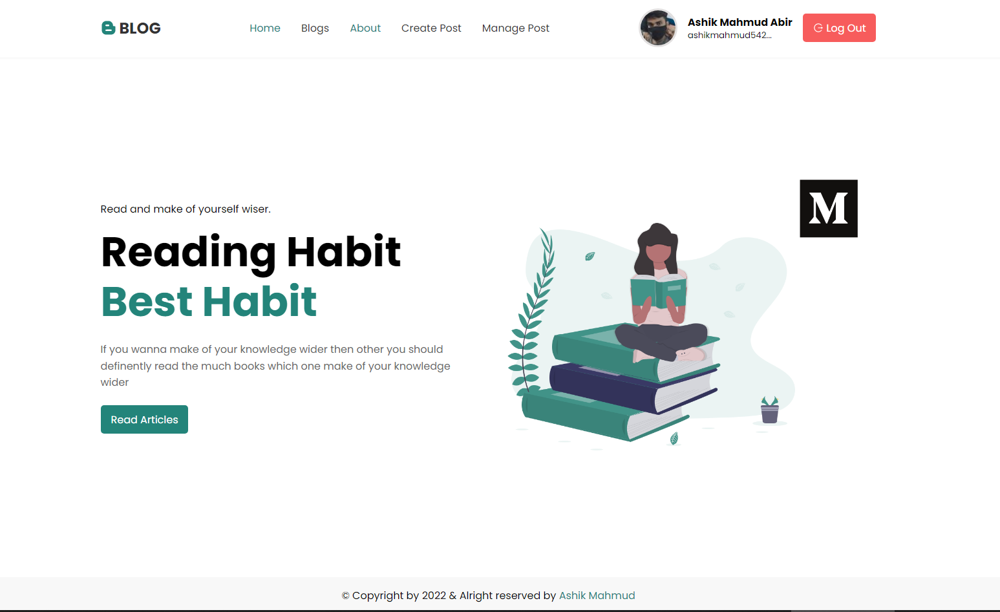

## Blogs Post Project using MongoDB Nodejs and Firebase

This is blogs application using mongoDB node js firebase

## Using Technologies

#### Front end

- React js
- React Router Dom
- React Hot Toast
- Firebase
- react-hook-form
- react-icons
- styled-components

#### Back end

- MongoDB
- NodeJs
- Express js
- Cors
- Axios
- DotEnv

## Require Features

- You can login using Email password,
- You also can create account
- Also Sign In with Google, Facebook account
- Create your own post
- Also delete the post as well as modify
-

### Live Link

## Application Preview

> THanks for reach out me on github.
